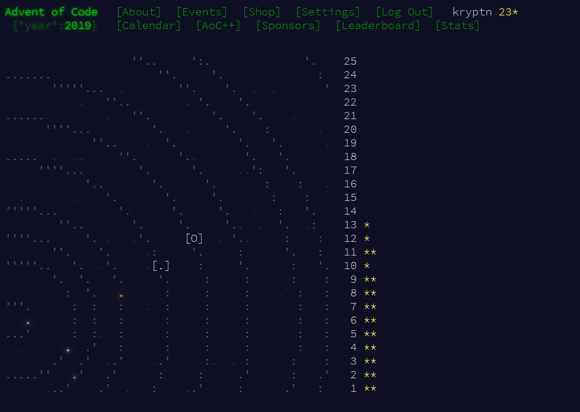

# advent-of-code-2019

My attempts for Advent of Code 2019 in Nim

The itch I wanted to scratch was all about the intcode interpreter.

I got bored going back to refactor some code, so some of the intcode ones don't work anymore

Obviously, these are spoilers. Don't ruin your fun.

`nimble run dayN`

